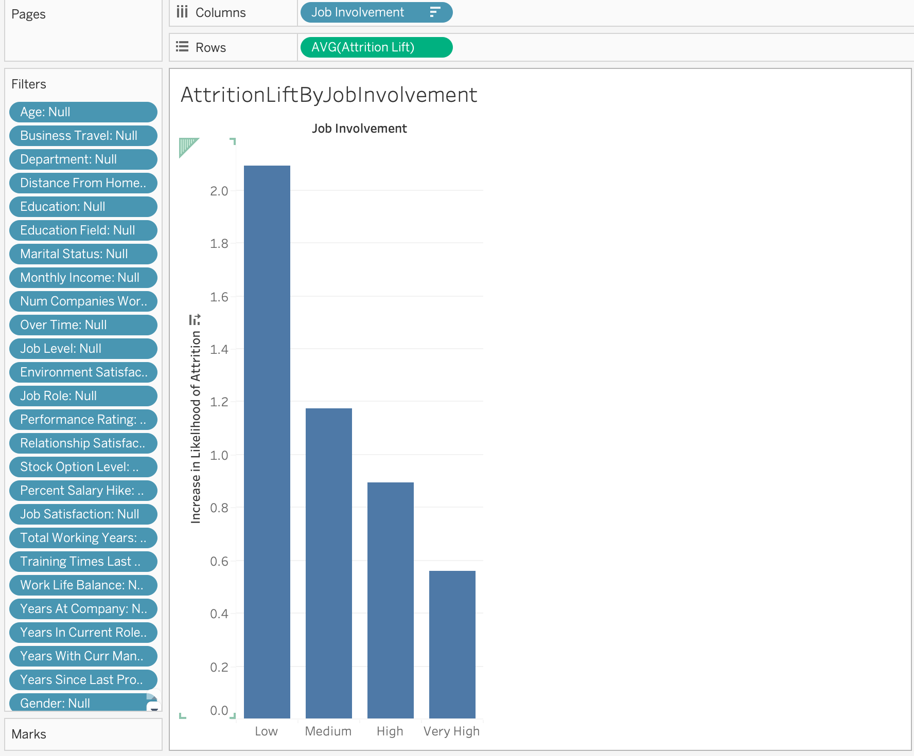
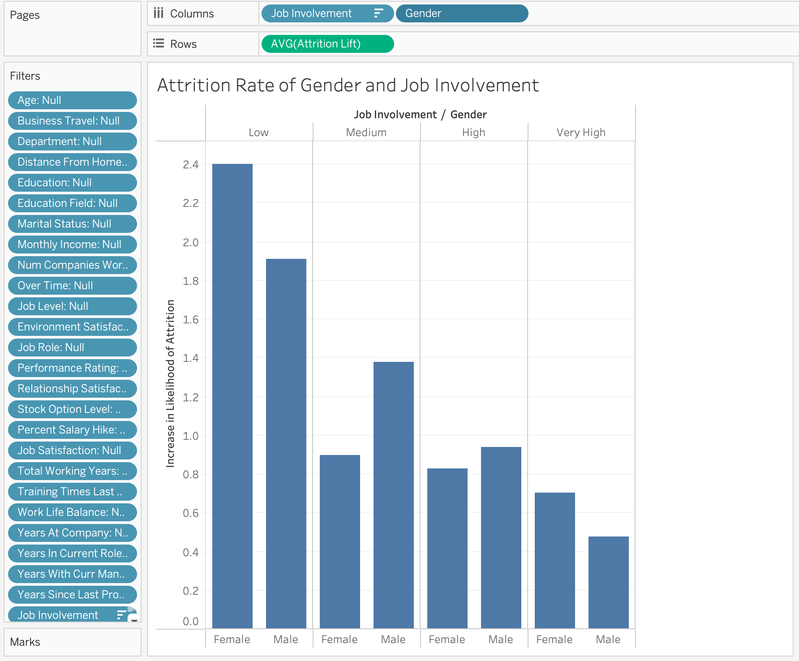
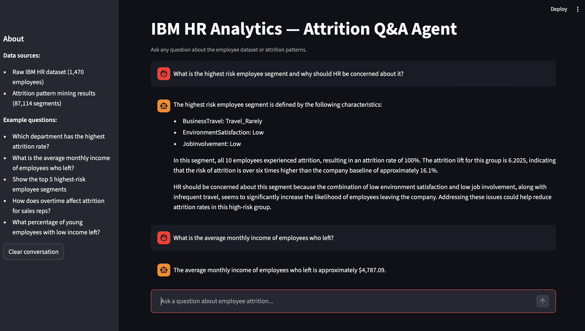

# IBM HR Analytics — Employee Attrition & Performance

Dataset: IBM HR Analytics (1,470 employees, 35 columns) from Kaggle.

---

## Project 1 — Attrition Prediction

End-to-end ML pipeline to predict employee attrition.

**Notebook:** [IBM_HR_Attrition.ipynb](IBM_HR_Attrition.ipynb)

### What's covered
- EDA — distributions, correlation heatmap, pairplot, boxplots, stacked bar charts, feature correlation with target
- Preprocessing — dropped constant/ID columns, label encoded target, one-hot encoded categoricals
- Dimensionality Reduction — PCA (for visualization)
- Modeling — Logistic Regression, Random Forest, SVM, KNN, XGBoost
- Tuning — GridSearchCV with ROC-AUC scoring
- Evaluation — Confusion matrices, ROC curves
- Interpretability — Random Forest feature importance, SHAP summary plot

### Best model
SVM (linear kernel, C=0.1) — ROC-AUC: 0.811

### Future improvements
- [ ] **Class imbalance handling** — Apply SMOTE or `class_weight='balanced'` to address the 84/16 split. Currently models are biased toward predicting "Stayed."
- [ ] **Feature engineering** — Add derived features: income per year of experience, satisfaction composite score, tenure per role, promotion stagnation ratio.
- [ ] **Focused EDA with commentary** — Reduce to 5-6 most insightful findings with markdown explanations (e.g. "Employees who work overtime show significantly higher attrition — indicating burnout").
- [ ] **Connect PCA to modeling** — Either use PCA-reduced features in at least one model for comparison, or remove the section.
- [ ] **Cross-validation scores** — Add `cross_val_score` with 5-fold CV to report variance in model estimates beyond a single train-test split.
- [ ] **Business narrative** — Add intro explaining the business problem and a conclusion section summarizing top findings and recommended HR actions.

---

## Project 2 — Attrition Pattern Mining

Groupby-based pattern mining to find employee segments with high attrition rates.

**Script:** [Project2_AssociationRules/ibm_hr_association_rules.py](Project2_AssociationRules/ibm_hr_association_rules.py)

**Output:** `Project2_AssociationRules/attrition_groupby_rules.csv`

### Approach
- Bins all numerical columns into labeled ranges (e.g. Age → Young/Mid/Senior)
- Maps ordinal scales (satisfaction, job level, education) to readable labels
- Groups employees by every 1-, 2-, and 3-column combination (27 feature columns, ~87K groups)
- For each group: counts Attrition Yes/No, computes attrition rate and lift vs. overall population (~16.1%)
- Filters groups with fewer than 10 employees

### Key findings
- **Sales Representatives** have the highest single-feature attrition rate (40%, 2.47x baseline)
- **OverTime=Yes** affects 28% of employees and drives 31% attrition (1.89x)
- **Low Job Involvement + Low Environment Satisfaction** combinations push attrition above 80–90%
- Senior employees (JobLevel Senior/Executive, long tenure) have near-zero attrition (<5%)
- Strongest 3-column signal: `EnvironmentSatisfaction=Low + MonthlyIncome=Low + OverTime=Yes` → 88% attrition (15/17 employees)

---

## Tableau Dashboard — Attrition Lift Analysis

**Workbook:** [Project2_AssociationRules/Attrition.twbx](Project2_AssociationRules/Attrition.twbx)

The Tableau workbook visualises attrition lift (group attrition rate ÷ company-wide rate of ~16.1%) derived from `attrition_groupby_rules.csv`. A lift of 1.0 means the group leaves at the average rate; above 1.0 means elevated risk.

---

### Chart 1 — Attrition Lift by Job Involvement



This chart shows the average attrition lift across all employee groups, broken down by Job Involvement level.

| Job Involvement | Lift |
|---|---|
| Low | ~2.1x |
| Medium | ~1.15x |
| High | ~0.9x |
| Very High | ~0.55x |

**What it shows:** A clear monotonic relationship — the less involved an employee feels, the more likely they are to leave. Employees with Low involvement are more than twice as likely to attrite as the average employee, while Very High involvement employees are nearly half as likely.

---

### Chart 2 — Attrition Lift by Job Involvement and Gender



This chart adds Gender as a dimension to see whether the involvement-attrition relationship differs between men and women.

| Job Involvement | Female | Male |
|---|---|---|
| Low | ~2.4x | ~1.9x |
| Medium | ~1.0x | ~1.3x |
| High | ~1.0x | ~0.9x |
| Very High | ~0.7x | ~0.5x |

**What it shows:** The overall trend holds for both genders, but the gap is widest at Low involvement — females with low involvement leave at 2.4x the baseline vs 1.9x for males. At High and Very High involvement the gender difference effectively disappears.

---

### Root Cause Analysis (RCA)

**Problem:** Why do certain employee groups show attrition rates 2–4x above the company baseline?

**Finding 1 — Job Involvement is the strongest engagement signal.**
Across all segments, involvement level is the most consistent predictor of attrition lift. Low involvement is not just a symptom — it is likely a leading indicator: employees disengage before they resign. This suggests attrition is predictable weeks or months in advance if engagement is tracked.

**Finding 2 — Low involvement hits women harder.**
At the Low involvement tier, female employees show a 26% higher lift than male employees (2.4x vs 1.9x). This may reflect role distribution (e.g. more women in Sales or HR roles with inherently lower involvement scores) or differential responses to disengagement. HR should investigate whether low-involvement female employees are concentrated in specific departments or job roles.

**Finding 3 — Involvement loss compounds with other stressors.**
From the broader groupby analysis, Low Job Involvement combined with OverTime=Yes or Low Environment Satisfaction pushes attrition rates to 80–90%. Involvement alone is a risk; involvement combined with burnout factors is a near-certain exit signal.

**Recommended actions:**
- Flag employees with dropping involvement scores for proactive check-ins
- Audit the distribution of low-involvement roles by gender and department
- Treat Low Involvement + Overtime as a high-priority retention alert — this combination has the highest concentration of imminent leavers

---

## Project 3 — Agentic Q&A on Attrition Data

A conversational AI agent that lets anyone ask natural language questions about the IBM HR dataset and attrition patterns — no SQL or Python required.

**Script:** [Project3_AgentQA/agent.py](Project3_AgentQA/agent.py)  
**App:** [Project3_AgentQA/app.py](Project3_AgentQA/app.py)

### What to expect



The agent is powered by GPT-4o and has access to two live datasets:

- **Raw IBM HR dataset** (`df1`) — 1,470 employees with all original attributes. Ask employee-level questions: averages, distributions, counts by department/role/etc.
- **Attrition pattern mining results** (`df2`) — 87,114 pre-computed segments. Ask segment-level questions: which groups are highest risk, what combinations drive attrition, lift analysis.

The agent writes and executes Python/pandas code behind the scenes to answer each question, then explains the result in plain English.

### Example questions
- *"Which department has the highest attrition rate?"*
- *"What is the average monthly income of employees who left vs stayed?"*
- *"Which group has the highest attrition lift and what are all the characteristics?"*
- *"How does overtime affect attrition for sales representatives?"*
- *"What percentage of young employees with low income left the company?"*

### Running locally

```bash
# From the SD root
uv sync
# Add your OpenAI key to .env: OPENAI_API_KEY=sk-...
uv run streamlit run Project3_AgentQA/app.py
```

### Stack
- **LangChain** + `create_pandas_dataframe_agent` for agent orchestration
- **GPT-4o** as the reasoning model
- **Streamlit** for the chat UI
- **uv** for dependency management
